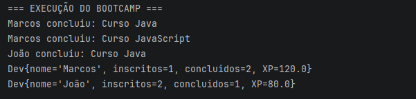

# Desafio de Código – Programação Orientada a Objetos em Java

Este desafio faz parte do módulo de **Programação Orientada a Objetos (POO)** do bootcamp **Accenture – Desenvolvimento Java & Cloud (DIO)**.

O objetivo principal foi **desmistificar os pilares da POO em Java**, aplicando-os na prática por meio da modelagem de um problema real e da construção de um domínio consistente.

---

## 🎯 Objetivo do Desafio

Praticar e consolidar os quatro pilares da Programação Orientada a Objetos:

- Abstração  
- Encapsulamento  
- Herança  
- Polimorfismo  

A proposta do desafio é desenvolver a capacidade de **abstração de domínio**, criando classes, relações e comportamentos coerentes, além de permitir evoluções e melhorias conforme o entendimento do problema amadurece.

---

## 🧠 Conceitos Trabalhados

Durante a implementação, foram praticados:

- Criação de classes representando entidades do domínio
- Encapsulamento de atributos e regras de negócio
- Uso de herança para reaproveitamento de comportamentos
- Aplicação de polimorfismo para flexibilizar o código
- Organização e interligação das classes de domínio
- Evolução incremental da solução

---

## ✨ Evoluções Aplicadas

Além da implementação base proposta no desafio, este projeto recebeu pequenos refinamentos com foco em boas práticas de Programação Orientada a Objetos, tais como:

- Encapsulamento das operações de inscrição e adição de conteúdos no `Bootcamp`
- Redução do acoplamento entre as classes de domínio
- Uso de `Optional` para controle seguro do fluxo de progressão
- Melhor organização da saída de dados por meio do método `toString()`
- Código orientado à intenção do domínio, evitando manipulação direta de estruturas internas

As evoluções mantêm o escopo original do desafio e têm como objetivo tornar o código mais legível, coeso e alinhado a cenários reais de desenvolvimento.

---

## ▶️ Exemplo de Execução

Abaixo está um exemplo de execução da aplicação em console, demonstrando:

- Inscrição de desenvolvedores no bootcamp
- Progressão nos conteúdos
- Cálculo de XP acumulado
- Estado final de cada desenvolvedor

---

## 📚 Conteúdo das Aulas Relacionadas

O código deste desafio foi desenvolvido gradualmente ao longo das seguintes aulas:

1. Apresentação e visão geral de Programação Orientada a Objetos  
2. Configuração do ambiente  
3. Abstração e encapsulamento  
4. Herança e polimorfismo – Parte 1  
5. Herança e polimorfismo – Parte 2  
6. Conclusão da criação das classes de domínio  
7. Interligação das classes  
8. Entendimento e refinamento do desafio  

Esse processo ajudou a transformar conceitos teóricos em prática real de código.

---

## 🔧 Evoluções e Aprendizados

Embora o desafio forneça uma implementação de referência, este repositório representa **meu processo de aprendizado**, incluindo:

- Ajustes feitos para melhor entendimento dos conceitos
- Refatorações conforme a evolução do conhecimento
- Exploração prática dos pilares da POO

A ideia foi usar o desafio como base para aprender **quando e por que aplicar cada conceito**, e não apenas reproduzir código.

---

## 🔗 Referência

- Repositório original do desafio disponibilizado pela DIO (fork utilizado como base de estudo)

